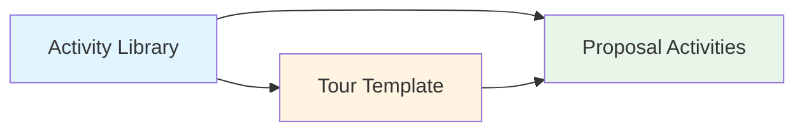

The Activity Library is a centralized repository of activities and experiences that can be referenced across tours and proposals. Activities help describe what travelers will do during their journey.

## Activity Structure

Activities are stored in the `activity_library` table:

```typescript
type ActivityLibraryItem = {
  id: string;
  name: string;
  description?: string;
  imageUrl?: string;
  organizationId?: string; // null for global activities
  isGlobal: boolean;
  createdAt: Date;
};
```

## Global vs. Organization Activities

Activities exist in two scopes:

### Global Activities
- `isGlobal: true` and `organizationId: null`
- Available to all organizations
- Common activities like "Game Drive", "Bush Walk", "Cultural Visit"
- Cannot be modified by organizations
- Curated by platform administrators

### Organization Activities
- `isGlobal: false` and `organizationId` set to your organization
- Private to your organization
- Custom activities specific to your tours
- Can be created and managed by your team

## Searching Activities

Find activities using the search endpoint:

```typescript
const activities = await trpc.activities.search.query({
  query: 'game drive',
  limit: 10
});

activities.forEach(activity => {
  console.log(activity.id, activity.name);
});

// Returns activities from:
// 1. Global library (isGlobal = true)
// 2. Your organization's library (organizationId = your org)
```

### Search Behavior

<Tabs>
  <Tab title="With Query">
    ```typescript
    // Search by name (case-insensitive)
    const results = await trpc.activities.search.query({
      query: 'drive',
      limit: 20
    });
    
    // Matches:
    // - "Game Drive"
    // - "Night Drive"
    // - "Bush Drive"
    ```
    
    Results are filtered by partial name match and sorted alphabetically.
  </Tab>
  
  <Tab title="Empty Query">
    ```typescript
    // Empty/whitespace query returns first N activities
    const results = await trpc.activities.search.query({
      query: '',
      limit: 10
    });
    
    // Returns first 10 activities (global + org)
    ```
    
    Useful for populating dropdowns and activity pickers.
  </Tab>
</Tabs>

<Info>
  The search endpoint returns **only `id` and `name`** fields for performance. Full activity details (description, image) are not included in search results.
</Info>

## Creating Activities

Add custom activities to your organization's library:

<Steps>
  <Step title="Prepare Activity Data">
    Decide on a clear activity name:
    
    ```typescript
    const activityName = 'Sunset Dhow Cruise';
    ```
  </Step>

  <Step title="Create Activity">
    Use the `create` mutation:
    
    ```typescript
    const activity = await trpc.activities.create.mutate({
      name: 'Sunset Dhow Cruise'
    });
    
    console.log('Created:', activity.id, activity.name);
    ```
    
    The activity is automatically:
    - Associated with your organization
    - Marked as `isGlobal: false`
    - Available immediately for your tours
  </Step>

  <Step title="Use in Tours">
    Reference the activity ID in tour data:
    
    ```typescript
    // Tours store activities as JSON
    await trpc.tours.update.mutate({
      id: 'tour-uuid',
      activities: [
        { title: 'Evening Activity', activity_name: 'Sunset Dhow Cruise' }
      ]
    });
    ```
  </Step>
</Steps>

<Warning>
  The current `create` endpoint only accepts `name`. To set `description` or `imageUrl`, you'll need to update the database directly or extend the API.
</Warning>

## Activities in Tours

Tours reference activities via the `activities` JSON field:

```typescript
type Tour = {
  // ...
  activities: Array<{
    title: string;        // Display label
    activity_name: string; // Activity name/reference
  }>;
};
```

### Example Tour Activities

```typescript
await trpc.tours.update.mutate({
  id: 'safari-tour-uuid',
  activities: [
    {
      title: 'Wildlife Viewing',
      activity_name: 'Game Drive'
    },
    {
      title: 'Walking Safari',
      activity_name: 'Bush Walk'
    },
    {
      title: 'Local Culture',
      activity_name: 'Maasai Village Visit'
    },
    {
      title: 'Scenic Views',
      activity_name: 'Sunset Viewing'
    }
  ]
});
```

<Note>
  Tour activities are stored as **JSON**, not foreign keys. The `activity_name` field is a string reference to the activity name, not an ID. This provides flexibility but means activity renames don't propagate automatically.
</Note>

## Activities in Proposals

Proposals have more structured activity management through the `proposal_activities` table:

```typescript
type ProposalActivity = {
  id: string;
  proposalDayId: string;
  name: string;
  description?: string;
  location?: string;
  moment: 'Morning' | 'Afternoon' | 'Evening' | 'Half Day' | 'Full Day' | 'Night';
  isOptional: boolean;
  imageUrl?: string;
  createdAt: Date;
};
```

### Creating Proposal Activities

When building proposals from tours, activities can be added per day:

```typescript
// Example proposal day with activities
proposalDays: [
  {
    dayNumber: 1,
    title: 'Serengeti Game Drive',
    activities: [
      {
        name: 'Morning Game Drive',
        description: 'Early morning wildlife viewing in Serengeti',
        location: 'Serengeti National Park',
        moment: 'Morning',
        isOptional: false
      },
      {
        name: 'Bush Lunch',
        description: 'Picnic lunch in the wilderness',
        location: 'Serengeti',
        moment: 'Afternoon',
        isOptional: false
      },
      {
        name: 'Sundowner',
        description: 'Evening drinks watching the sunset',
        location: 'Serengeti Plains',
        moment: 'Evening',
        isOptional: true
      }
    ]
  }
]
```

## Common Safari Activities

Here are typical activities in the global library:

<AccordionGroup>
  <Accordion title="Game Drives">
    **Variations:**
    - Morning Game Drive
    - Afternoon Game Drive
    - Full Day Game Drive
    - Night Game Drive
    - Sunrise Game Drive
    - Sunset Game Drive
    
    **Description ideas:**
    - "Explore the park in a 4x4 safari vehicle"
    - "Search for the Big Five with experienced guides"
    - "Wildlife viewing during prime activity hours"
  </Accordion>

  <Accordion title="Walking Safaris">
    **Variations:**
    - Bush Walk
    - Guided Nature Walk
    - Walking Safari
    - Forest Walk
    
    **Description ideas:**
    - "Guided walking safari with armed ranger"
    - "Experience the bush on foot, tracking wildlife"
    - "Learn about smaller creatures and plants"
  </Accordion>

  <Accordion title="Cultural Experiences">
    **Variations:**
    - Maasai Village Visit
    - Cultural Tour
    - Local Market Visit
    - Traditional Dance Performance
    - Community Visit
    
    **Description ideas:**
    - "Visit a traditional Maasai village"
    - "Learn about local customs and traditions"
    - "Interact with community members"
  </Accordion>

  <Accordion title="Water Activities">
    **Variations:**
    - Boat Safari
    - Dhow Cruise
    - Canoeing
    - Fishing
    - Snorkeling
    - Swimming
    
    **Description ideas:**
    - "Boat cruise along the river"
    - "Traditional dhow sailing at sunset"
    - "Snorkeling in crystal-clear waters"
  </Accordion>

  <Accordion title="Special Experiences">
    **Variations:**
    - Hot Air Balloon Safari
    - Horseback Safari
    - Cycling Tour
    - Sundowner
    - Photography Session
    - Bird Watching
    - Star Gazing
    
    **Description ideas:**
    - "Hot air balloon flight over the Serengeti"
    - "Sundowner drinks with panoramic views"
    - "Guided bird watching with expert naturalist"
  </Accordion>
</AccordionGroup>

## Activity Moments

When activities are added to proposals, they're categorized by time:

- **Morning**: Early activities (sunrise, dawn game drives)
- **Afternoon**: Post-lunch activities
- **Evening**: Sunset activities, sundowners
- **Half Day**: 4-5 hour activities
- **Full Day**: All-day activities
- **Night**: After-dark activities (night drives, star gazing)

```typescript
// Moment is enforced in proposal activities
moment: 'Morning' | 'Afternoon' | 'Evening' | 'Half Day' | 'Full Day' | 'Night'
```

## Optional Activities

Activities in proposals can be marked as optional:

```typescript
{
  name: 'Hot Air Balloon Safari',
  description: 'Optional sunrise balloon flight (additional cost)',
  moment: 'Morning',
  isOptional: true // Indicates activity is not included in base price
}
```

Use optional activities for:
- Paid add-ons
- Weather-dependent activities
- Activities requiring advance booking
- Premium experiences

## Best Practices

<AccordionGroup>
  <Accordion title="Activity Naming">
    Use clear, descriptive names:
    
    ✅ **Good names:**
    - "Morning Game Drive"
    - "Guided Bush Walk"
    - "Maasai Village Visit"
    - "Sunset Dhow Cruise"
    
    ❌ **Poor names:**
    - "Activity 1"
    - "GD" (abbreviations)
    - "The Best Activity Ever!!!"
    - "Activity" (too generic)
    
    **Guidelines:**
    - Include time of day if relevant
    - Specify location type when helpful
    - Keep under 50 characters
    - Use title case
  </Accordion>

  <Accordion title="When to Create Custom Activities">
    Create organization activities when:
    
    ✅ **You should create custom activities for:**
    - Unique experiences you offer
    - Branded activities ("Our Special Bush Dinner")
    - Partner activities ("XYZ Lodge Spa Treatment")
    - Region-specific activities not in global library
    
    ❌ **Don't create duplicates for:**
    - Standard activities (use global library)
    - Simple variations (use description field instead)
    - One-off activities (add directly to proposals)
  </Accordion>

  <Accordion title="Activity Descriptions">
    Write compelling activity descriptions:
    
    **Structure:**
    1. What: Brief activity description
    2. Where: Location context
    3. Why: What makes it special
    4. Duration/timing: When it happens
    
    **Example:**
    ```
    "Hot Air Balloon Safari
    
    Experience the Serengeti from above during a spectacular sunrise 
    balloon flight. Drift silently over the plains as wildlife awakens 
    below. This 1-hour flight is followed by a champagne breakfast in 
    the bush. Available year-round, subject to weather conditions.
    (Optional, additional cost $550 per person)"
    ```
  </Accordion>

  <Accordion title="Activity Library Management">
    Maintain a clean activity library:
    
    - **Audit regularly**: Remove unused activities
    - **Standardize naming**: Consistent capitalization and format
    - **Avoid redundancy**: Check for similar activities before creating
    - **Document internally**: Keep notes on activity specifics
    - **Use tags/categories**: If implementing filtering (future feature)
  </Accordion>
</AccordionGroup>

## Limitations & Considerations

<Warning>
  **Current Limitations**
  
  1. **No description/image in create**: The `create` mutation only accepts `name`
  2. **No update endpoint**: Activities can't be modified via API after creation
  3. **No delete endpoint**: Activities can't be removed via API
  4. **String references**: Tour activities use name strings, not foreign keys
  5. **Simple search**: Search only matches activity names, not descriptions
</Warning>

## Activity Data Flow



1. **Activity Library**: Central repository (global + organization)
2. **Tour Templates**: Reference activities by name in JSON
3. **Proposal Activities**: Structured per-day activities with full details

<Info>
  Tours use a **loose reference** (JSON with activity names) while proposals use **structured records** (database table with foreign keys). This allows flexibility in tours and precision in proposals.
</Info>

## Example: Building Activity Workflow

<Steps>
  <Step title="Check Global Library">
    ```typescript
    const globalActivities = await trpc.activities.search.query({
      query: 'game drive',
      limit: 10
    });
    
    // Check if suitable activities exist
    ```
  </Step>

  <Step title="Create if Needed">
    ```typescript
    if (!globalActivities.find(a => a.name === 'Photography Game Drive')) {
      const activity = await trpc.activities.create.mutate({
        name: 'Photography Game Drive'
      });
    }
    ```
  </Step>

  <Step title="Add to Tour Template">
    ```typescript
    await trpc.tours.update.mutate({
      id: 'tour-uuid',
      activities: [
        { title: 'Wildlife Photography', activity_name: 'Photography Game Drive' },
        { title: 'Landscape Shots', activity_name: 'Scenic Drive' }
      ]
    });
    ```
  </Step>

  <Step title="Use in Proposals">
    ```typescript
    // When creating proposal from tour, transform to structured activities
    const proposalActivities = tour.activities.map(act => ({
      name: act.activity_name,
      description: `Enjoy ${act.activity_name.toLowerCase()}`,
      moment: 'Full Day',
      isOptional: false
    }));
    ```
  </Step>
</Steps>

## Related Resources

<CardGroup cols={2}>
  <Card title="Creating Tours" icon="map-location-dot" href="/tours/creating-tours">
    Add activities to tour templates
  </Card>
  <Card title="Itineraries" icon="map" href="/tours/itineraries">
    Structure daily activities in itineraries
  </Card>
  <Card title="Proposals" icon="file-contract" href="/proposals/creating-proposals">
    Detailed per-day activities in proposals
  </Card>
  <Card title="API Reference" icon="code" href="/api/routers/activities">
    Complete activities API documentation
  </Card>
</CardGroup>